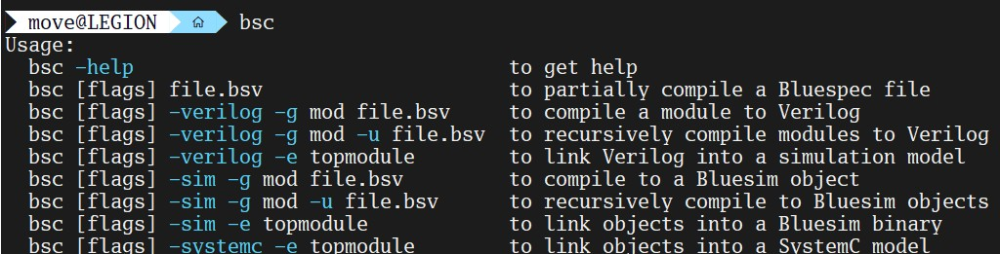

#Enviroment SetUP

##install bsc
```
https://github.com/B-Lang-org/bsc/blob/main/INSTALL.md
```

##1 Pre-request
```
sudo apt-get install ghc
sudo apt-get install \
    libghc-regex-compat-dev \
    libghc-syb-dev \
    libghc-old-time-dev \
    libghc-split-dev

sudo apt-get install \
    ghc-prof \
    libghc-regex-compat-prof \
    libghc-syb-prof \
    libghc-old-time-prof \
    libghc-split-prof

sudo apt-get install build-essential
sudo apt-get install pkg-config

sudo apt-get install \
    autoconf \
    gperf

sudo apt-get install flex bison
sudo apt-get install iverilog
sudo apt-get install \
    texlive-latex-base \
    texlive-latex-recommended \
    texlive-latex-extra \
    texlive-font-utils \
    texlive-fonts-extra
```


##2 get bsc source
```
git clone --recursive https://github.com/B-Lang-org/bsc

```

##3 install
```
make install-src
```

